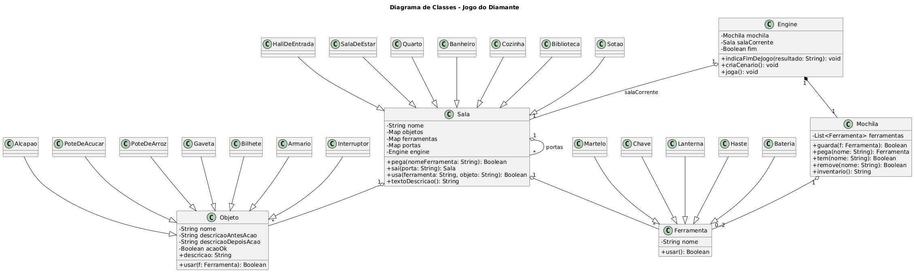

# 💎 Diamante na Escuridão — Jogo de Texto Orientado a Objetos em JavaScript

Projeto acadêmico desenvolvido como parte da disciplina **Programação Orientada a Objetos** (PUCRS - Tecnólogo em ADS), com foco na construção de um **jogo de texto interativo** utilizando conceitos fundamentais de **POO**, estrutura modular e boas práticas de organização de código.

---

## 🚀 Tecnologias e Ferramentas Utilizadas

| Tecnologia     | Descrição                                                  |
|----------------|------------------------------------------------------------|
| **Node.js**    | Ambiente de execução JavaScript no lado do servidor        |
| **JavaScript (ES6+)** | Linguagem base do projeto, utilizando classes e módulos |
| **Prompt-sync**| Biblioteca para entrada síncrona via terminal (CLI)        |
| **bycontract** | Biblioteca para validação de tipos de argumentos           |
| **PlantUML** *(opcional)* | Para geração de diagramas de classe UML         |

---

## 📦 Estrutura do Projeto

```
📁 projeto/
 ┣ 📜 index.js               # Ponto de entrada (executa o jogo)
 ┣ 📜 JogoDemo.js            # Subclasse de Engine, define o cenário e fluxo principal
 ┣ 📜 Basicas.js             # Classes base: Engine, Sala, Objeto, Ferramenta, Mochila
 ┣ 📜 SalasDemo.js           # Implementação das salas específicas e suas conexões
 ┣ 📜 FerramentasDemo.js     # Ferramentas derivadas (Martelo, Lanterna, etc.)
 ┣ 📜 ObjetosDemo.js         # Objetos interativos e suas regras de uso
 ┣ 📜 README.md              # Documentação do projeto
```

---

## 🎮 Visão Geral do Jogo

O jogador assume o papel de um ladrão profissional, contratado para invadir uma mansão e localizar um **diamante escondido**. A jogabilidade se dá por comandos de texto digitados no terminal, com decisões que podem levar à vitória ou à captura.

Para encontrar o diamante, o jogador deve:

- Explorar as salas da mansão
- Coletar ferramentas e utilizá-las de forma correta
- Interpretar pistas ocultas (ex: um bilhete lido com lanterna)
- Tomar a decisão certa ao final (escolher o pote correto)

---

## 🧠 Conceitos de Programação Orientada a Objetos Aplicados

### ✅ **Herança**
- `Ferramenta` → `Martelo`, `Lanterna`, `Chave`, etc.
- `Objeto` → `Bilhete`, `Gaveta`, `PoteDeAcucar`, etc.
- `Sala` → `Biblioteca`, `Cozinha`, `Quarto`, etc.

### ✅ **Encapsulamento**
- Atributos privados com `#` e acesso controlado via métodos (`mochila`, `salaCorrente`, etc.)

### ✅ **Polimorfismo**
- O método `usar()` tem implementações específicas em cada ferramenta ou objeto, variando seu comportamento conforme o contexto.

### ✅ **Composição**
- Cada `Sala` contém `Objetos`, `Ferramentas` e referências para outras `Salas`.
- A `Engine` compõe o cenário e coordena o estado geral do jogo.

---

## 🧪 Como Executar

> Pré-requisitos: [Node.js](https://nodejs.org/) instalado (versão 14+ recomendada)

1. Clone o repositório:

```bash
git clone https://github.com/seu-usuario/seu-repositorio.git
cd seu-repositorio
```

2. Instale as dependências:

```bash
npm install prompt-sync bycontract
```

3. Execute o jogo:

```bash
node index.js
```

---

## 🕹️ Comandos Disponíveis no Jogo

| Comando                          | Ação                                                                 |
|----------------------------------|----------------------------------------------------------------------|
| `ir [nome_da_sala]`              | Move-se para uma sala adjacente                                      |
| `abrir [objeto]`                 | Abre um objeto                                                        |
| `pegar [ferramenta]`            | Pega uma ferramenta e a armazena na mochila (máx. 2 itens)           |
| `remover [ferramenta]`         | Remove ferramenta da mochila                                         |
| `usar [objeto]`                | Interage com um objeto da sala atual                                |
| `usar [ferramenta] [objeto]`  | Usa uma ferramenta em um objeto específico                          |
| `inventario`                   | Lista ferramentas atuais na mochila                                 |
| `fim`                          | Encerra o jogo (abandona missão)                                     |

---

## 🧩 Exemplo de Enigma

> O ponto alto do jogo envolve interpretar a pista “a vida é doce” encontrada em um bilhete.

O jogador deve:
1. Encontrar e ler o bilhete com a **lanterna**
2. Escolher entre **dois potes**: açúcar ou arroz
3. Usar o **martelo** no pote certo para vencer o jogo

Um erro leva ao **alarme sendo ativado** e **fim de jogo com derrota**.

---

## 📈 Diagrama de Classes UML

Se desejar visualizar as relações de herança e composição do projeto, utilize o arquivo PlantUML gerado a partir das classes (`Basicas.js`, etc.).

Ferramentas recomendadas:
- [PlantUML Online Server](https://plantuml.com/server)
- VS Code com plugin *PlantUML Preview*

---

## 👨‍💻 Autor

**Dionatan Henrique Santos de Castro**  
Estudante de Análise e Desenvolvimento de Sistemas - PUCRS

---

## 📜 Licença

Este projeto foi desenvolvido exclusivamente para fins educacionais.


---

## 🗺️ Mapa da Mansão

O jogo se desenrola em 7 salas conectadas, com objetos e ferramentas distribuídas estrategicamente:


---

## 📐 Diagrama de Classes UML

Abaixo, o diagrama mostra a estrutura de classes do jogo com herança, composição e relacionamentos entre os principais elementos:


